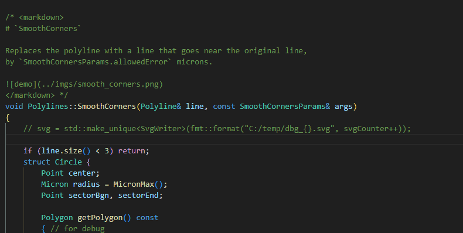

# `Bamakom`

A VSCode extension that displays markdown within code files, exactly where it is needed.

## Features

Write markdown inside your source code files, and wrap it with <markdown> tags </markdown>, like this:
```c++

void foo() {
    /* <markdown>
## This is how. 

To render this, move your mouse on top the
`markdown` tag above.
    </markdown> */
}

```



Images links should be relative to the source file folder.

> Note: mermaid diagrams and math are not supported. This is a 
  real bummer. Internally the [VS Code markdown renderer](https://code.visualstudio.com/api/references/vscode-api#Hover) does
  the work, but I cant find out how to make it render everything.

TODO
- check if there are closing tags